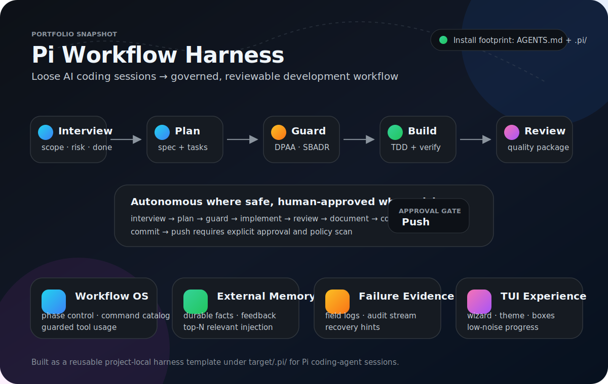
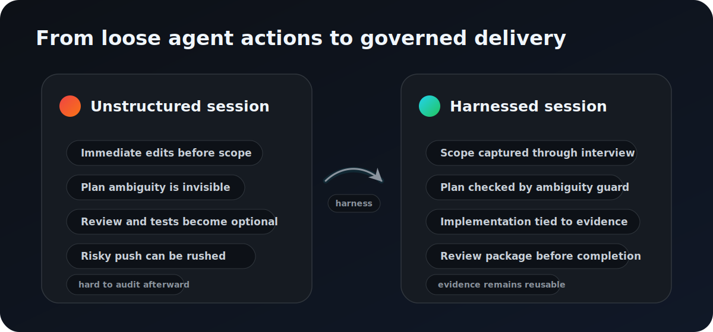
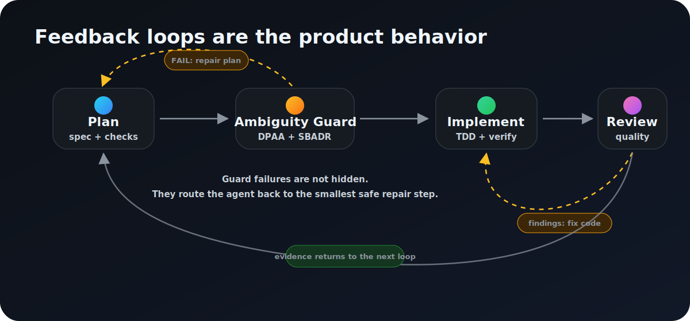
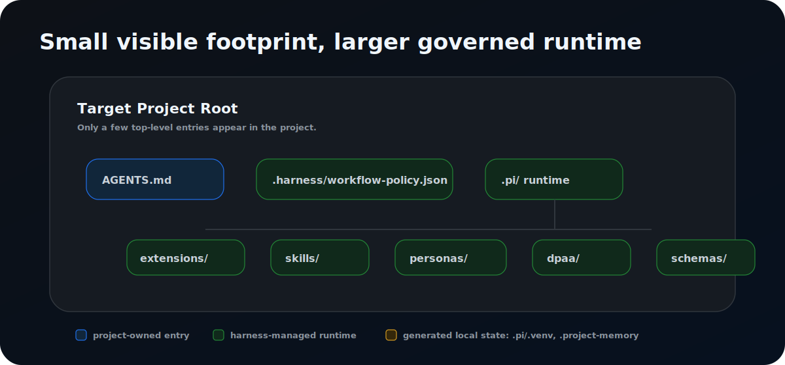

# harness

[한국어 README](README.md)



## What this is

**A project-local harness that turns Pi-based AI coding sessions into a governed flow: `interview → plan → guard → implement → review → document → commit/push`.**

It is not just a prompt collection. It is a reusable runtime template for AI-assisted software delivery, adding **SDLC governance, mechanical quality gates, external memory, and failure-evidence logging** to coding-agent sessions.



## How it works

The key behavior is not simple automation. It is a **recoverable loop**: ambiguous plans return to planning, review findings return to implementation, and evidence feeds the next iteration.



Default phases:

```text
interview
→ plan
→ plan_review      # DPAA/SBADR ambiguity guard
→ implement        # TDD/verification-aware execution
→ code_review      # self-review + independent review + quality gate
→ review_approved
→ document
→ commit
→ push             # human approval + policy scan
→ done
```

- Safe segments can advance autonomously.
- The `commit → push` risk boundary requires human approval and policy scanning.
- Guard failures default to repair and retry, not skip.
- Run Ledger, task queue, and external memory leave restart cues for the next iteration.

## What gets installed



`target/` is the distributable template in this source repository. Installing the harness into another project copies the relevant `target/.pi/` runtime files into that project's `.pi/` directory.

## Key components

| Area | Path | Purpose |
|---|---|---|
| Workflow runtime | `target/.pi/extensions/workflow.ts`, `target/.pi/extensions/workflow/` | phases, guards, command policy, reminders, ledger |
| Memory runtime | `target/.pi/extensions/memory.ts` | durable memory, candidate memory, feedback, relevance scoring |
| Skills/personas | `target/.pi/skills/`, `target/.pi/personas/` | review, trace, TDD, documentation, continuation safety, etc. |
| Policies/schemas | `target/.harness/`, `target/.pi/schemas/` | workflow hard rules, field log and memory schemas |
| TUI helpers/theme | `target/.pi/themes/`, `target/.pi/extensions/assistant-markdown-box.ts` | workflow console theme and boxed markdown rendering |
| Docs | `docs/` | guard recovery, runtime events, prompt contracts, protocol taxonomy |

## Ownership boundary

| Category | Harness-managed / updateable | Project-owned |
|---|---|---|
| Runtime | `.pi/extensions/`, `.pi/skills/`, `.pi/personas/`, `.pi/workflows/`, `.pi/dpaa/`, `.pi/sbadr/` | `.pi/local/`, `.pi/config/`, `.pi/LOCAL.md` |
| Policy | `.harness/workflow-policy.json`, `.pi/WORKFLOW.md`, `.pi/GOVERNANCE.md` | `AGENTS.md` |
| Generated | `.pi/.venv/`, `.pi/.cache/`, `.pi/dpaa-runs/`, `.project-memory/` | local artifacts that should not be committed |

In installed projects, mutating runtime `.pi/extensions/**` requires explicit user confirmation. In this source repository, `target/.pi/extensions/**` is normal deployment-template source code.

---

# Commands

## Install into another project

Run from the target project's root.

### Windows PowerShell

```powershell
$p=Join-Path $env:TEMP 'init-harness.ps1'; Invoke-WebRequest https://raw.githubusercontent.com/chochanyeon/harness/main/scripts/init-target-harness.ps1 -OutFile $p; $env:HARNESS_DEST=(Get-Location).Path; powershell -NoProfile -ExecutionPolicy Bypass -File $p
```

### macOS/Linux

```bash
curl -fsSL https://raw.githubusercontent.com/chochanyeon/harness/main/scripts/init-target-harness.sh | sh
```

Then start Pi from the same project root.

```bash
pi
```

Check the installation:

```text
/workflow doctor
```

## Component-specific install

```bash
# workflow only
curl -fsSL https://raw.githubusercontent.com/chochanyeon/harness/main/scripts/init-target-harness.sh | sh -s -- --component workflow

# memory only
curl -fsSL https://raw.githubusercontent.com/chochanyeon/harness/main/scripts/init-target-harness.sh | sh -s -- --component memory
```

Clean reinstall removes managed runtime files and copies them again. `AGENTS.md`, `.pi/LOCAL.md`, and `.ai/interview` artifacts are preserved.

```powershell
$p=Join-Path $env:TEMP 'init-harness.ps1'; Invoke-WebRequest https://raw.githubusercontent.com/chochanyeon/harness/main/scripts/init-target-harness.ps1 -OutFile $p; $env:HARNESS_DEST=(Get-Location).Path; powershell -NoProfile -ExecutionPolicy Bypass -File $p -Clean
```

```bash
curl -fsSL https://raw.githubusercontent.com/chochanyeon/harness/main/scripts/init-target-harness.sh | sh -s -- --clean
```

## Update an installed harness

Run from the installed project's root.

### Windows PowerShell

```powershell
$p=Join-Path $env:TEMP 'update-harness.ps1'; Invoke-WebRequest https://raw.githubusercontent.com/chochanyeon/harness/main/scripts/update-harness.ps1 -OutFile $p; powershell -NoProfile -ExecutionPolicy Bypass -File $p
```

### macOS/Linux

```bash
curl -fsSL https://raw.githubusercontent.com/chochanyeon/harness/main/scripts/update-harness.sh | sh
```

Component-specific update:

```bash
# workflow only
curl -fsSL https://raw.githubusercontent.com/chochanyeon/harness/main/scripts/update-harness.sh | sh -s -- --component workflow

# memory only
curl -fsSL https://raw.githubusercontent.com/chochanyeon/harness/main/scripts/update-harness.sh | sh -s -- --component memory
```

Updates overwrite upstream-managed files only. Put project-specific customizations under `.pi/local/` or `.pi/config/`.

## Main runtime commands

### Workflow

```text
/workflow start <title>
/workflow status
/workflow approve
/workflow doctor
/workflow failures
/workflow failures export
/workflow list
/workflow load <id>
/workflow unload
/workflow state <phase>
/workflow skip <gate> <reason>
/workflow abort
/workflow dpaa-audit
```

### Memory

```text
/memory remember <text>
memory_remember({ text })
/memory list
/memory search <query>
/memory show <id>
/memory disable <id>
/memory enable <id>
/memory explain
/memory doctor
/memory stats
/memory feedback <id> helpful|irrelevant|wrong|stale
/memory missed <description>
```

## Preview the bundled target template

```bash
cd target
pi
```

## Minimum verification commands

```bash
python -m pytest tests/test_workflow_fake_llm_session.py -q
python -m pytest tests/test_harness_consumer_smoke.py -q
python -m pytest tests/test_workflow_reminders.py tests/test_workflow_run_command.py tests/test_code_quality_gate.py tests/test_workflow_tool_policy.py -q
```
