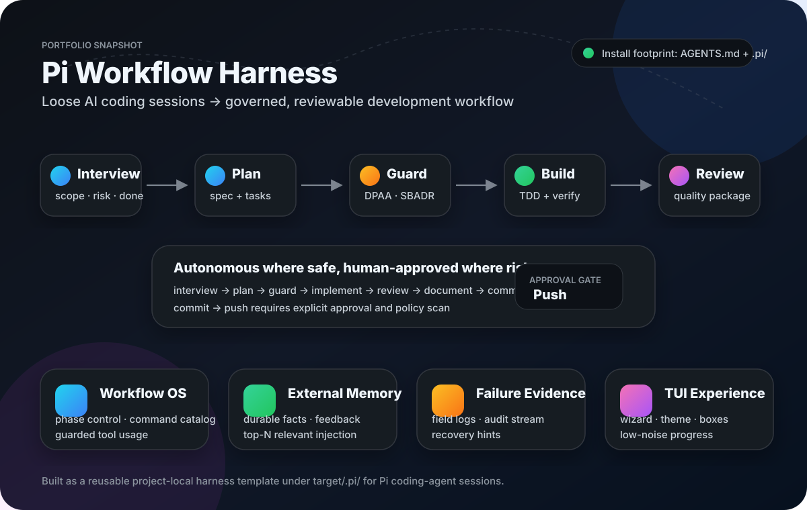
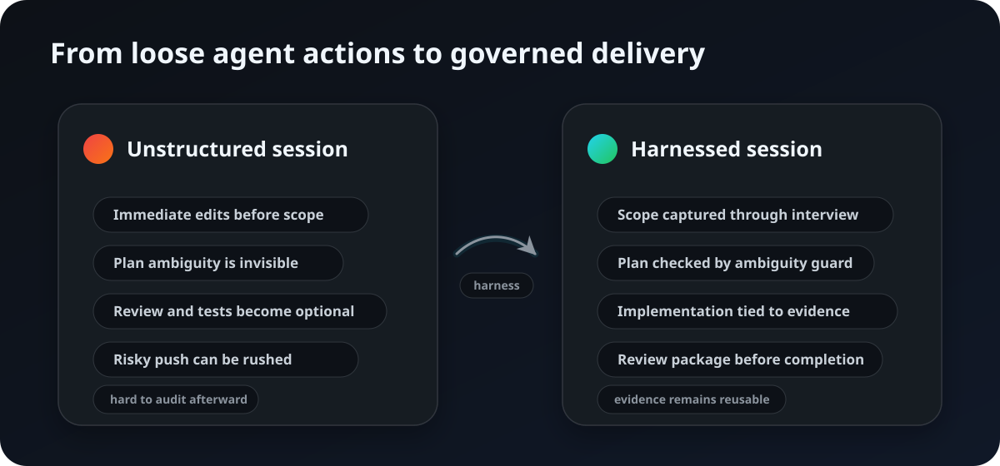
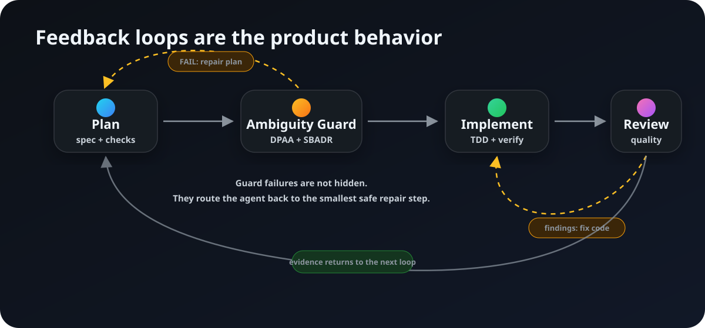
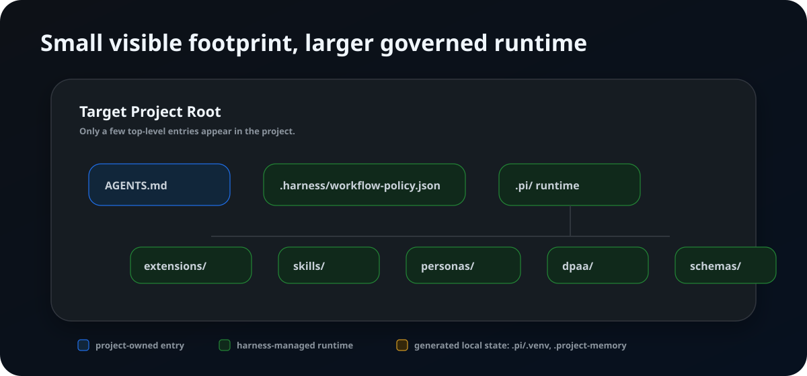

# harness

[English README](README.en.md)



## What this is

**Pi 기반 AI 코딩 세션을 `interview → plan → guard → implement → review → document → commit/push` 흐름으로 묶어 주는 프로젝트 로컬 하네스입니다.**

단순 프롬프트 모음이 아니라, AI 개발 세션에 **SDLC 거버넌스, 기계적 품질 게이트, 장기 기억, 실패 증거 로그**를 붙인 재사용 가능한 런타임 템플릿입니다.



## How it works

핵심은 “자동화”가 아니라 **되돌아갈 수 있는 loop**입니다. 계획이 모호하면 구현으로 가지 않고 plan을 보수하고, 리뷰에서 문제가 나오면 완료 처리하지 않고 다시 수정합니다.



기본 phase:

```text
interview
→ plan
→ plan_review      # DPAA/SBADR ambiguity guard
→ implement        # TDD/verification-aware execution
→ code_review      # self-review + independent review + quality gate
→ review_approved
→ document
→ commit
→ push             # human approval + policy scan
→ done
```

- 안전한 구간은 agent가 자율 진행합니다.
- 위험 경계인 `commit → push`는 사용자 승인과 policy scan을 요구합니다.
- guard 실패는 skip이 아니라 원인 수정 후 재시도가 기본입니다.
- Run Ledger, task queue, external memory가 다음 iteration의 재개 단서를 남깁니다.
- long-running workflow에서는 heartbeat와 `workflow_run_command` 증거를 남겨 context pollution을 줄입니다.
- runtime workflow prompt는 현재 phase의 행동·전이·필수 guard 증거만 주입해 context noise를 줄입니다.
- Pre-code_review 단계의 누락된 검증은 `code_review → review_approved` 전에 드러나며, 나중에 처리할 개선은 명시적으로 deferred로 남깁니다.
- plan.md에 `Phase Template: light`를 선언하면 해당 workflow만 `document` phase를 건너뜁니다. 선언이 없으면 지금과 같은 10-phase 순서(full)가 적용됩니다.
- `implement` phase에서 `project-test`/`code-quality`가 성공하면 익스텐션이 기계적으로 로컬 git 체크포인트 커밋을 만듭니다. `git-reset-hard-to-checkpoint <hash>`로 이전 체크포인트로 다시 돌아갈 수 있고, `commit` phase의 `git-reset-soft-to-checkpoint-base`가 최종 push되는 이력을 하나의 깨끗한 커밋으로 squash합니다.

## What gets installed



`target/`는 이 저장소의 배포 템플릿입니다. 다른 프로젝트에 설치하면 `target/.pi/` 내용이 해당 프로젝트의 `.pi/`로 배치됩니다.

## Godot 4.x 프로젝트 지원

루트에 `project.godot`가 있는 프로젝트는 일반 빌드 파일보다 먼저 Godot 프로젝트로 감지됩니다(하네스 저장소 자체의 특수 감지는 항상 우선합니다). workflow 컴포넌트를 설치하고 Godot **4.x headless CLI**와 프로젝트에 맞는 export templates를 준비해야 합니다. 하네스는 엔진이나 export templates를 설치하지 않습니다.

### Workflow 명령 매핑

| 하네스 명령 | Godot adapter action | 동작 |
|---|---|---|
| `project-test` | `test` | 설정한 프로젝트 루트 내부 test scene 실행 |
| `project-build` | `export` | 설정한 preset으로 export (컴파일이 아님) |
| `code-quality` | `gate` | `quality → test → export` 순서의 review gate |

`code-quality`의 `gate`는 세 단계를 고정 순서로 실행하고 앞 단계가 실패해도 뒤 단계 진단을 보존합니다. 설치 후 개발 저장소의 `target/.pi/`를 수정했다면 `bash scripts/sync-dev-harness.sh` (Windows: `powershell -File scripts\sync-dev-harness.ps1`)를 실행해 `target/.pi/`를 로컬 `.pi/`에 동기화합니다.

### `.pi/local/godot.json` 계약

설정 파일은 선택 사항이며 아래 일곱 키만 허용합니다. `unset`은 해당 값이 없고 adapter discovery 또는 해당 action의 필수 설정을 따른다는 뜻입니다.

| 키 | 타입 | 기본값 |
|---|---|---|
| `godot_bin` | string | `unset` (`GODOT_BIN` → 설정값 → 플랫폼 후보 탐색) |
| `test_scene` | string | `unset` (`test`/`gate`에 필요) |
| `export_preset` | string | `unset` (`export`/`gate`에 필요) |
| `export_output` | string | `unset` (`export`/`gate`에 필요) |
| `timeout_seconds` | number | `60.0` |
| `fail_on_warning` | boolean | `false` |
| `overwrite_export` | boolean | `false` |

예시:

```json
{
  "godot_bin": "godot4",
  "test_scene": "tests/test_scene.tscn",
  "export_preset": "Linux",
  "export_output": "build/game.pck",
  "timeout_seconds": 60.0,
  "fail_on_warning": false,
  "overwrite_export": false
}
```

Scene와 export output은 canonical project root 아래에 있어야 하며 symlink 경계를 넘을 수 없습니다. warning-only 결과는 기본적으로 `status: warning` (gate aggregate는 `pass`) 및 exit code `0`입니다. `fail_on_warning: true`이면 실패합니다. 기존 regular export 파일도 기본적으로 덮어쓰지 않으며, `overwrite_export: true`일 때만 허용됩니다(symlink와 non-regular 파일은 항상 거부).

Adapter 상태는 `pass`, `warning`, `fail`, `config-error`, `tool-error`, `timeout`입니다. `pass`/`warning`은 exit code `0`, 나머지는 `1`이며, gate의 fatal 상태는 review 승인을 막습니다.

지원 범위는 Godot 4.x 감지, CLI 버전 확인, headless editor/import 및 script parse/check, external resource 검사, 설정한 test scene 실행, 안전한 export, Windows/Linux argv 실행과 JSON 진단입니다. Godot 3.x, editor UI 자동화, gameplay semantics/art 품질 판단, 엔진/templates 설치, shell 문자열 실행, 임의 test argv는 지원하지 않습니다.

## Key components

| 영역 | 위치 | 역할 |
|---|---|---|
| Workflow runtime | `target/.pi/extensions/workflow.ts`, `target/.pi/extensions/workflow/` | phase, guard, command policy, reminders, ledger |
| Memory runtime | `target/.pi/extensions/memory.ts` | durable memory, candidate memory shortlist, LLM-judgment 실시간 승격/사용, AGENTS.md 반영 제안 추적, feedback-aware relevance scoring, supersede/merge lifecycle 명령 |
| Skills/personas | `target/.pi/skills/`, `target/.pi/personas/` | review, trace, TDD, documentation, continuation safety 등 |
| Policies/schemas | `target/.harness/`, `target/.pi/schemas/` | workflow hard rules, field log/memory schema |
| TUI helpers/theme | `target/.pi/themes/`, `target/.pi/extensions/assistant-markdown-box.ts` | workflow console theme, boxed markdown rendering |
| Docs | `docs/` | guard recovery, runtime events, prompt contracts, protocol taxonomy |

## Ownership boundary

| 분류 | 하네스가 관리/갱신 가능 | 프로젝트가 소유 |
|---|---|---|
| Runtime | `.pi/extensions/`, `.pi/skills/`, `.pi/personas/`, `.pi/workflows/`, `.pi/dpaa/`, `.pi/sbadr/` | `.pi/local/`, `.pi/config/`, `.pi/LOCAL.md` |
| Policy | `.harness/workflow-policy.json`, `.pi/WORKFLOW.md`, `.pi/GOVERNANCE.md` | `AGENTS.md` |
| Generated | `.pi/.venv/`, `.pi/.cache/`, `.pi/dpaa-runs/`, `.project-memory/` | 커밋하지 않는 로컬 산출물 |

설치된 프로젝트의 runtime `.pi/extensions/**` 수정은 사용자 승인이 필요합니다. 단, 이 저장소에서는 `target/.pi/extensions/**`가 배포 템플릿 소스이므로 일반 개발 대상입니다.

---

# Commands

## 다른 프로젝트에 설치

설치할 프로젝트 루트에서 실행합니다.

### Windows PowerShell

```powershell
$p=Join-Path $env:TEMP 'init-harness.ps1'; Invoke-WebRequest https://raw.githubusercontent.com/chochanyeon/harness/main/scripts/init-target-harness.ps1 -OutFile $p; $env:HARNESS_DEST=(Get-Location).Path; powershell -NoProfile -ExecutionPolicy Bypass -File $p
```

### macOS/Linux

```bash
curl -fsSL https://raw.githubusercontent.com/chochanyeon/harness/main/scripts/init-target-harness.sh | sh
```

설치 후 같은 프로젝트 루트에서 Pi를 실행합니다.

```bash
pi
```

설치 상태 확인:

```text
/workflow doctor
```

## component별 설치

```bash
# workflow만 설치
curl -fsSL https://raw.githubusercontent.com/chochanyeon/harness/main/scripts/init-target-harness.sh | sh -s -- --component workflow

# memory만 설치
curl -fsSL https://raw.githubusercontent.com/chochanyeon/harness/main/scripts/init-target-harness.sh | sh -s -- --component memory
```

깨끗하게 재설치하려면 managed runtime을 지우고 다시 복사합니다. `AGENTS.md`, `.pi/LOCAL.md`, `.ai/interview` 산출물은 보존됩니다.

```powershell
$p=Join-Path $env:TEMP 'init-harness.ps1'; Invoke-WebRequest https://raw.githubusercontent.com/chochanyeon/harness/main/scripts/init-target-harness.ps1 -OutFile $p; $env:HARNESS_DEST=(Get-Location).Path; powershell -NoProfile -ExecutionPolicy Bypass -File $p -Clean
```

```bash
curl -fsSL https://raw.githubusercontent.com/chochanyeon/harness/main/scripts/init-target-harness.sh | sh -s -- --clean
```

## 업데이트

설치된 프로젝트 루트에서 실행합니다.

### Windows PowerShell

```powershell
$p=Join-Path $env:TEMP 'update-harness.ps1'; Invoke-WebRequest https://raw.githubusercontent.com/chochanyeon/harness/main/scripts/update-harness.ps1 -OutFile $p; powershell -NoProfile -ExecutionPolicy Bypass -File $p
```

### macOS/Linux

```bash
curl -fsSL https://raw.githubusercontent.com/chochanyeon/harness/main/scripts/update-harness.sh | sh
```

component별 업데이트:

```bash
# workflow만 업데이트
curl -fsSL https://raw.githubusercontent.com/chochanyeon/harness/main/scripts/update-harness.sh | sh -s -- --component workflow

# memory만 업데이트
curl -fsSL https://raw.githubusercontent.com/chochanyeon/harness/main/scripts/update-harness.sh | sh -s -- --component memory
```

업데이트는 upstream-managed 파일만 덮어씁니다. 프로젝트별 사용자 정의는 `.pi/local/` 또는 `.pi/config/` 아래에 두세요.

## 주요 runtime 명령

### Workflow

```text
/workflow start <title>
/workflow status
/workflow approve
/workflow doctor
/workflow failures
/workflow failures export
/workflow failures report   # alias: /workflow failures improve
/workflow list
/workflow load <id>
/workflow unload
/workflow state <phase>
/workflow skip <gate> <reason>
/workflow abort
/workflow dpaa-audit
```

### Memory

```text
/memory remember <text>
memory_remember({ text })
/memory list
/memory search <query>
/memory show <id>
/memory disable <id>
/memory enable <id>
/memory explain
/memory doctor
/memory stats
/memory feedback <id> helpful|irrelevant|wrong|stale
/memory missed <description>
/memory supersede <oldId> <newId>       # oldId를 superseded 상태로 바꿔 검색/주입에서 제외, newId의 supersedes에 기록
/memory merge <survivorId> <id2> [<id3> ...]  # survivor는 그대로 두고 나머지를 모두 survivor로 supersede(내용 합치기 없음)
memory_use_candidate({ memoryId, relevanceReason })       # candidate 요약 목록에서 관련 있는 항목을 상태 변경 없이 현재 턴에 사용
memory_promote_candidate({ memoryId, triggerKind, evidence })  # 명시적 확인/반복 확인/작업 성공 신호가 있을 때만 candidate→active 승격, 세션당 5건 상한, 근거 필수
memory_propose_agents_promotion({ memoryId, proposedText })    # useCount·helpful feedback 기준을 넘은 memory를 AGENTS.md 반영 후보로 사용자에게 제안했음을 기록 (실제 파일 수정은 하지 않음)
memory_record_agents_decision({ memoryId, decision, note })    # 사용자의 AGENTS.md 반영 수락/거부 결정을 기록
```

## 개발 repo에서 템플릿 미리보기

```bash
cd target
pi
```

## 최소 검증 명령

```bash
python -m pytest tests/test_workflow_fake_llm_session.py -q
python -m pytest tests/test_harness_consumer_smoke.py -q
python -m pytest tests/test_workflow_reminders.py tests/test_workflow_run_command.py tests/test_code_quality_gate.py tests/test_workflow_tool_policy.py -q
```
