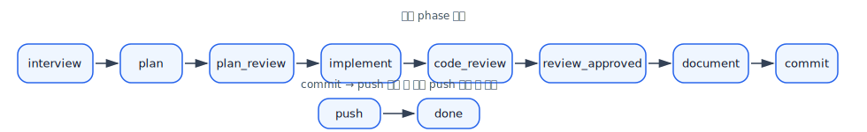
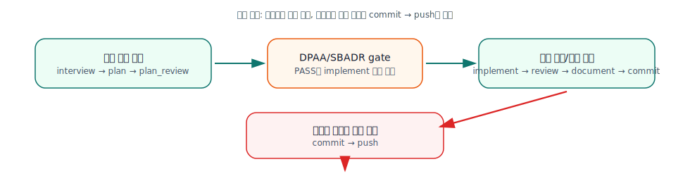
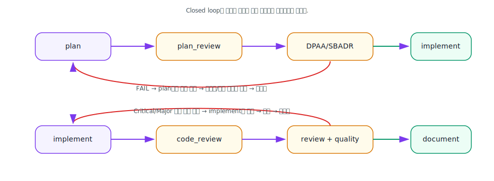
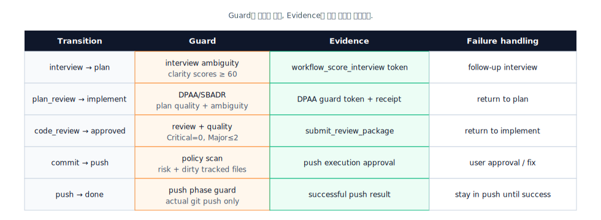
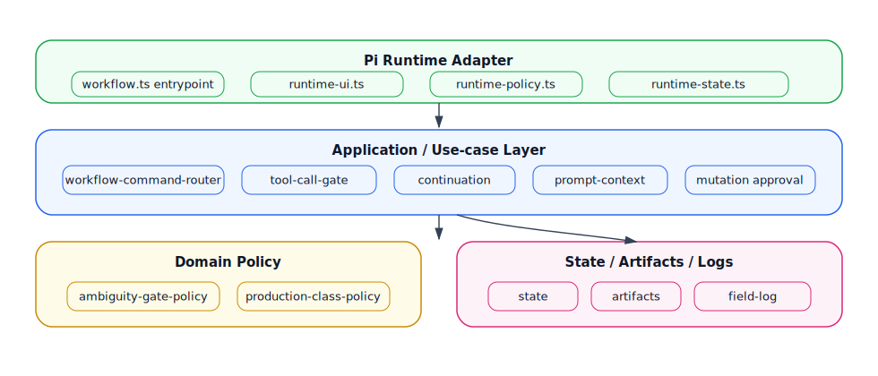
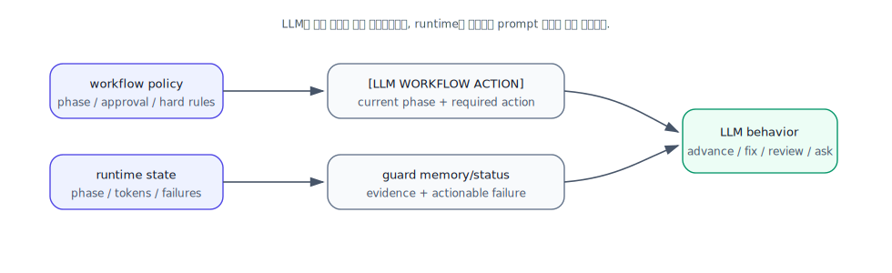
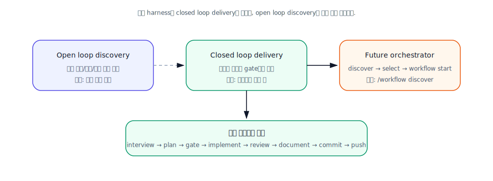
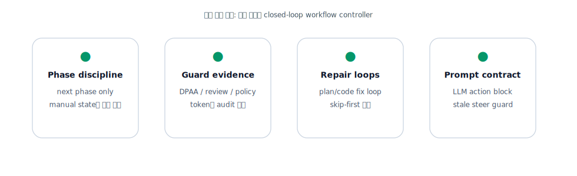
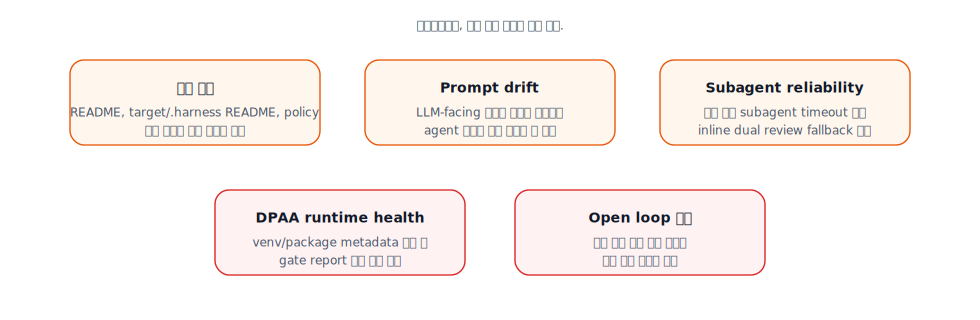
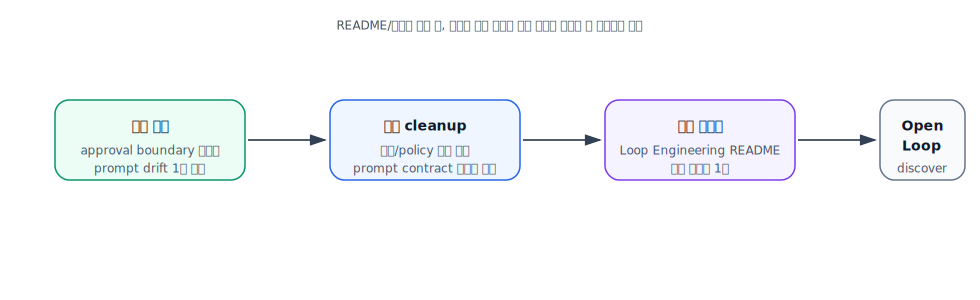

<!--
Tistory posting bundle
1. Upload the files under docs/blog/assets/workflow-harness-current-state/ to Tistory.
2. Replace local image paths in this file/HTML with the Tistory CDN URLs if the editor does not preserve relative assets.
3. If SVG rendering is blocked by the skin/editor, convert the SVG files to PNG and replace .svg with .png.
-->

# Workflow Harness 현재 상태

> 작성일: 2026-06-29  
> 범위: Pi workflow harness의 현재 운영 모델, guard/evidence 구조, 자동 전이 정책, 최근 정리된 승인 경계 버그 반영 상태  
> 기준 소스: `README.md`, `.harness/workflow-policy.json`, `target/.pi/extensions/workflow/**`

---

## 1. 한 문장 요약

Workflow harness는 AI coding agent를 “자율적으로 움직이는 실행자”로 두되, phase, guard, evidence, review package, policy scan으로 감싸서 **검증 가능한 폐쇄 루프 안에서 작업을 끝내게 만드는 runtime controller**다.

핵심은 다음 세 가지다.

1. **자동 진행은 넓게 허용한다.**
   - `interview → plan → plan_review → implement`
   - `implement → code_review`
   - `review_approved → document → commit`
2. **사용자 승인은 위험 경계 하나에 집중한다.**
   - 현재 유일한 사용자 승인 경계: `commit → push`
3. **실패는 사용자에게 넘기기 전에 repair loop로 되돌린다.**
   - DPAA/SBADR 실패: `plan_review → plan`
   - review/quality 실패: `code_review → implement`

---

## 2. 현재 phase 모델



현재 phase 목록은 `.harness/workflow-policy.json`의 `phases`가 source of truth다.

```text
interview → plan → plan_review → implement → code_review → review_approved → document → commit → push → done
```

---

## 3. 자동 전이와 사용자 승인 경계



현재 정책상 `approvalBoundaries`는 다음 하나뿐이다.

```json
["commit:push"]
```

중요한 정리:

- `plan_review → implement`는 사용자 승인 경계가 아니다.
- `plan_review → implement`는 DPAA/SBADR gate가 통과하면 자동 전이된다.
- `commit → push`에서만 TUI yes/no 승인과 policy scan이 결합된다.

---

## 4. Closed loop: 실패 시 복구 루프



현재 하네스는 실패를 “대화로 넘기는 이벤트”가 아니라 “다음 수정 위치로 되돌리는 상태 전이”로 취급한다.

| 실패 지점 | 자동 복귀 | LLM 기본 행동 |
|---|---|---|
| DPAA/SBADR fail | `plan_review → plan` | 계획 문장, metric, 참조, 모호성을 고치고 재시도 |
| 품질 gate fail | `code_review → implement` | 원인 수정 후 테스트/품질 재실행 |
| Critical/Major review finding | `code_review → implement` | 지적 위치 수정 후 리뷰 루프 재진입 |
| push policy fail | `commit` 유지 | 위험 요약, 승인/수정, 재시도 |

---

## 5. Guard와 Evidence 구조



Evidence는 “토큰이 있으니 권한이 있다”가 아니라, 현재 workflow phase와 정상 전이 이력, gate 결과를 함께 확인하는 보조 증거다. 정책 source of truth는 `.harness/workflow-policy.json`의 phase/transition policy다.

---

## 6. Runtime 구성도



현재 구현은 `workflow.ts`를 entrypoint와 조립 계층으로 두고, 세부 책임을 `target/.pi/extensions/workflow/` 아래로 분리한다.

| 영역 | 대표 파일 | 책임 |
|---|---|---|
| Runtime wiring | `workflow.ts`, `runtime-ui.ts`, `runtime-policy.ts` | Pi 이벤트, TUI, active tool policy 연결 |
| Application | `application/workflow-command-router.ts`, `application/tool-call-gate.ts` | slash command, tool call, continuation, prompt 조립 |
| Domain policy | `domain/ambiguity-gate-policy.ts`, `domain/production-class-policy.ts` | 순수 정책 판단 |
| Gate/transition | `gates.ts`, `transitions.ts`, `gate-runner.ts` | 전이 전 검사, 실패 메시지, repair loop |
| Evidence/log | `runtime-state.ts`, `field-log.ts`, `artifacts.ts` | guard token, field log, artifact descriptor |

---

## 7. LLM-facing prompt 계약



최근 수정으로 prompt 계약에서 중요한 불일치가 제거됐다.

| 이전 문제 | 현재 상태 |
|---|---|
| `plan_review → implement`를 사용자 승인 경계로 안내 | DPAA/SBADR 자동 gate로 안내 |
| `yes/no dialog before implementation` 표현 | 제거됨 |
| `implementation approval dialog` 표현 | 제거됨 |
| `present the plan for approval` 표현 | 제거됨 |
| 사용자 승인 경계 설명 | `commit → push`만 명시 |

---

## 8. Open loop / Closed loop 관점에서 본 현재 위치



현재 harness는 closed loop delivery에 집중되어 있다. 즉, 사용자가 선택한 작업을 완료 조건까지 밀어붙이는 구조는 이미 강하다.

Open loop discovery는 아직 별도 phase나 명령으로 정식 구현되지는 않았다. 다만 다음 확장 지점은 명확하다.

- `/workflow discover`
- 후보 작업 backlog 생성
- 가치/위험/크기 평가
- 사용자가 선택한 후보를 기존 workflow closed loop로 전달

---

## 9. 현재 강점



- phase 이동이 명확하다.
- 전이별 gate/evidence가 분리되어 있다.
- 실패 시 기본 처리 방침이 LLM-facing 메시지에 포함된다.
- code review는 사용자 승인 대신 review package와 quality gate를 요구한다.
- push는 실제 `git push` 성공 관측으로만 `done` 처리된다.

---

## 10. 현재 주의 지점



주의할 점은 기능 자체보다 **정책과 prompt 설명의 동기화**다. 방금 수정한 버그도 실제 정책은 `commit → push`만 승인 경계였지만, LLM-facing 문구가 오래된 모델을 설명해서 발생했다.

---

## 11. 최근 반영된 상태: approval boundary guidance fix

최근 반영된 정리 내용은 다음과 같다.

| 항목 | 이전 | 현재 |
|---|---|---|
| 사용자 승인 경계 | `plan_review → implement`, `commit → push`처럼 설명되는 곳이 있었음 | `commit → push`만 |
| plan_review action | plan approval / implementation approval dialog | DPAA/SBADR gate 실행 |
| DPAA fail message | user approval 전 실패처럼 표현 | automatic implementation transition 전 실패 |
| 테스트 fixture | 구현 승인 표현 포함 | DPAA 전이 표현으로 정리 |
| 회귀 테스트 | 일부 LLM action 문구만 확인 | stale approval 표현 금지까지 확인 |

검증된 상태:

```text
Targeted regression: 139 passed
Project test:        364 passed, 1 skipped
Code quality:        364 passed, 1 skipped
```

---

## 12. 다음 단계 후보



추천 순서:

1. **문구 source of truth 정리**
   - workflow policy, README, prompt action block 간 중복을 줄인다.
2. **prompt contract test 확대**
   - LLM 행동을 흔드는 문구는 테스트로 pinning한다.
3. **Loop Engineering README 개편**
   - open loop / closed loop / evidence / guard / repair loop 중심으로 재구성한다.
4. **기술 블로그 연재화**
   - “AI에게 맡기는 것이 아니라 루프를 설계한다”는 관점으로 현재 경험을 정리한다.
5. **Open loop discovery 실험**
   - `/workflow discover` 또는 별도 discovery artifact로 다음 문제/기능 후보를 생성한다.

---

## 13. 결론

현재 workflow harness는 다음 상태다.

- **Closed-loop delivery controller는 동작 가능한 수준으로 정리되어 있다.**
- **사용자 승인 경계는 `commit → push` 하나로 수렴했다.**
- **`plan_review → implement`는 DPAA/SBADR 자동 gate 전이다.**
- **review/quality 실패는 implement repair loop로 되돌아간다.**
- **push는 실제 push 성공 관측으로만 done 처리된다.**
- **다음 큰 주제는 open loop discovery와 문서/블로그용 개념 정리다.**

이 문서는 README 전면 개편과 기술 블로그 초안의 중간 산출물로 사용할 수 있다.
