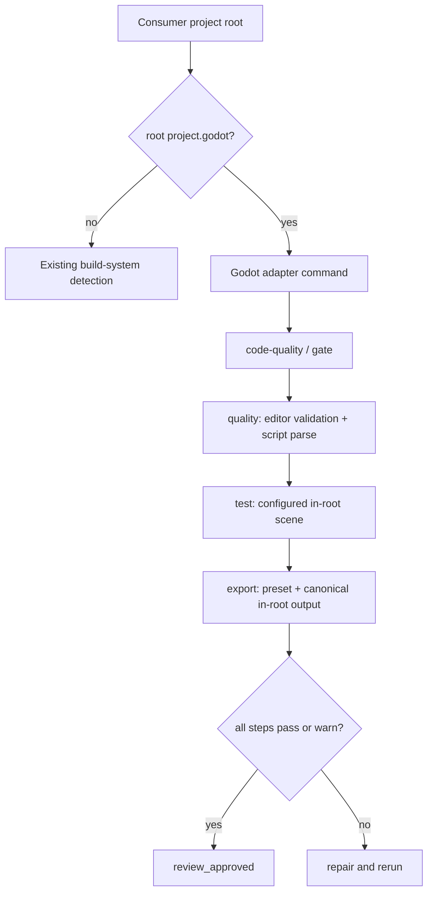

# Godot Harness Integration

## Context & Problem

Godot projects do not use the repository's generic Gradle, Maven, Node, or
Python build conventions. A consumer project needs a predictable Godot 4.x
CLI contract that can validate project resources and scripts, run a configured
test scene, and export a configured preset without turning project configuration
into arbitrary shell execution. The workflow also needs these checks at the
same quality gate used before `review_approved`.

## Mermaid Flow Diagram

## Decision Log

- Preserve harness-source detection first; inspect only a root-level
  `project.godot` before generic build files. Nested project files are ignored.
- Use the consumer adapter at
  `.pi/skills/godot-development/tools/godot_quality.py`, Python standard
  library process APIs, array arguments, `shell=false`, bounded output, and
  timeouts. The harness does not install Godot or export templates.
- Resolve the executable from `GODOT_BIN`, `.pi/local/godot.json` `godot_bin`,
  then platform candidates, and accept only Godot major version 4.
- Keep `.pi/local/godot.json` to seven project-owned keys. Paths for scenes and
  exports must remain below the canonical project root and may not cross
  symlinks. Existing export files are rejected unless `overwrite_export` is
  explicitly true for a regular file.
- Map `project-test` to `test`, `project-build` to `export`, and
  `code-quality` to `gate`. The gate always runs `quality → test → export` and
  retains diagnostics from every step.
- Treat warning-only results as non-fatal by default. Fatal statuses are
  `fail`, `config-error`, `tool-error`, and `timeout`; they block review
  approval.

## Changed-scope Summary

- Added Godot 4.x project detection and adapter command mapping to the workflow
  catalog.
- Added the safe Godot quality adapter, skill, workflow gate contract, fixtures,
  installation checks, and regression tests.
- Updated the Korean and English READMEs with prerequisites, configuration,
  command mapping, status/policy behavior, supported scope, and development
  synchronization guidance.
